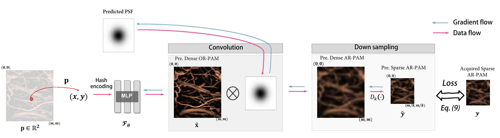

# AR2OR_INR

This is the official code repository of our work **"Resolution Enhancement of Under-sampled Photoacoustic Microscopy Images using Implicit Neural Representation"** accepted by TCI 2025. [[arXiv]](arXiv:2410.19786))

## Overview

*Fig. 1. The pipeline of the proposed sparse deconvolution reconstruction method.* 

## Simulated Sparse Deconvolution Reconstruction Example

*Fig. 2. Qualitative deconvolution results of all comparative methods on the mouse brain at different downsampling rates. (Scale bar: 2 mm).* 

## *In-vivo* Mouse Ear AR-PAM Image Reconstruction Example

*Fig. 3. Enhancement results of in vivo mouse ear AR-PAM images using different methods, along with our method’s PSF predictions at various downsampling rates. (Scale bar: 5 mm).* 

## 1. File Tree
```bash
AR2OR_INR
│   README.md                   # readme file
│   train.py                    # train file
│   loss.py                     # loss file
│   utils.py                    # tools
│
├── data
│     leaf.png  # demo data 
│     vessel.png  # demo data 
│
├── deconv_methods
│     inr_recon.py  # demo data 
│     
├── Fig
│     pipeline.png     
│     results1.png     

```


## 2. Running Environment
To run this project, you will need the following packages:
- PyTorch
- tinycudann
- tqdm
- NumPy 
- other dependencies
  

  
## 3. Train the model on simulated mouse brain ar-pam image
To train model from scratch, navigate to the project directory and run the following command in your terminal:


```bash
python train.py
```

The code will train the model to reconstruct a simulated mouse brain ar-pam image `data/vessel.png` under the following conditions:
- 4× down-sampling 
- FWHM = 50/um 


## 4. License

This code is available for non-commercial research and education purposes only. It is not allowed to be reproduced, exchanged, sold, or used for profit.


## Citation
```
@article{xiao2025resolution,
  title={Resolution Enhancement of Under-Sampled Photoacoustic Microscopy Images Using Neural Representation},
  author={Xiao, Youshen and Zhang, Zhengyuan and Sun, Ruixi and Shi, Yiling and Liao, Sheng and Zhang, Fan and Jiang, Yunhui and Chen, Xiyu and Sharma, Arunima and Pramanik, Manojit and others},
  journal={IEEE Transactions on Computational Imaging},
  volume={11},
  pages={678--688},
  year={2025},
  publisher={IEEE}
}
```
